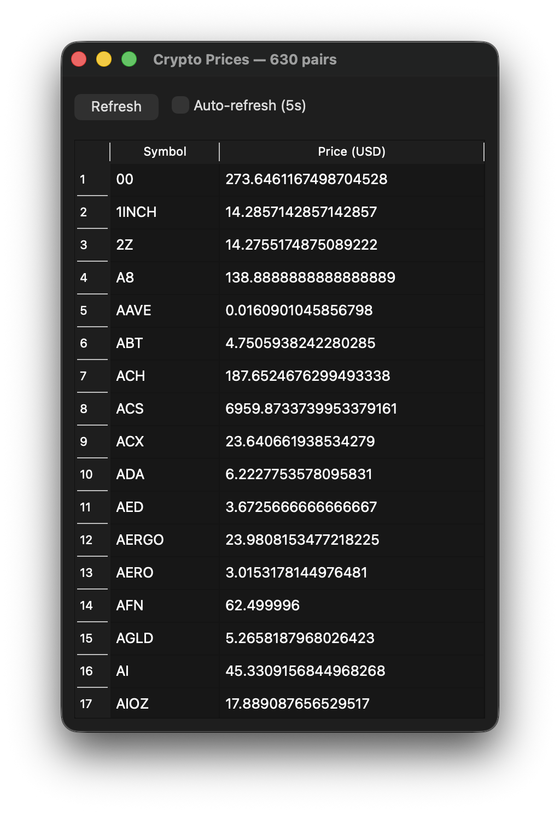

# crypto-live

A lightweight real-time cryptocurrency price viewer built with C++ and Qt 6. Fetches live exchange rates from the Coinbase API and displays them in a sortable table with optional auto-refresh.

## Features

- Live prices for 200+ crypto/fiat pairs via the Coinbase public API
- Async networking — UI never freezes during fetches
- Manual refresh button + auto-refresh every 5 seconds
- Sortable columns (click header to sort by symbol or price)

## Screenshot



## Requirements

- macOS (tested on macOS with Apple Silicon / Homebrew)
- CMake 3.15+
- Qt 6 (Widgets + Network modules)
- C++17 compiler

## Building

```bash
# Install dependencies (if not already installed)
brew install qt cmake

# Clone and build
git clone https://github.com/yashpatel-07/crypto-live.git
cd crypto-live
mkdir build && cd build
cmake .. -DCMAKE_PREFIX_PATH=$(brew --prefix qt)
make
./crypto_live
```

## Project Structure

```
crypto-live/
├── CMakeLists.txt
├── include/
│   └── json.hpp          # nlohmann/json (header-only)
└── src/
    ├── main.cpp
    ├── mainwindow.h
    └── mainwindow.cpp
```

## Data Source

Prices are fetched from the [Coinbase Exchange Rates API](https://docs.cdp.coinbase.com/sign-in-with-coinbase/docs/api-exchange-rates).  
All rates are relative to USD. No API key required.

## Third-Party Credits

### Qt 6

This application uses [Qt 6](https://www.qt.io/), specifically the `Qt6::Widgets` and `Qt6::Network` modules.  
Qt is used under the [GNU Lesser General Public License v3 (LGPL v3)](https://www.gnu.org/licenses/lgpl-3.0.html).

In accordance with the LGPL:

- Qt source code is available at https://code.qt.io
- This application dynamically links against Qt libraries, meaning you can relink the application against a modified version of Qt
- Qt's copyright is held by The Qt Company Ltd.

### nlohmann/json

This application uses [nlohmann/json](https://github.com/nlohmann/json) for JSON parsing.  
Licensed under the [MIT License](https://github.com/nlohmann/json/blob/develop/LICENSE.MIT).  
Copyright © 2013-2025 Niels Lohmann.
